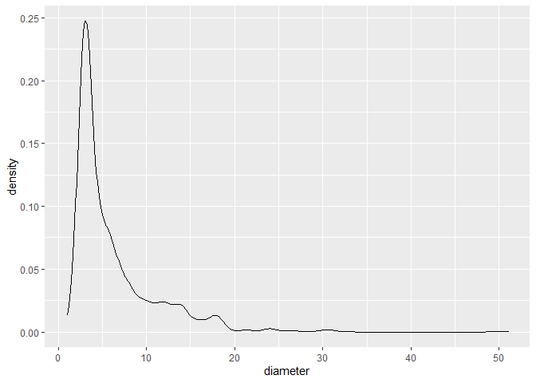
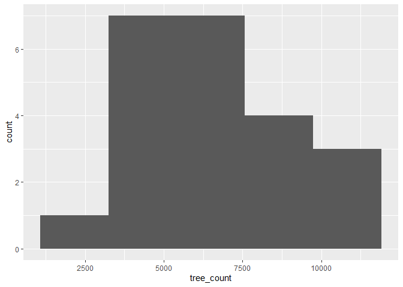
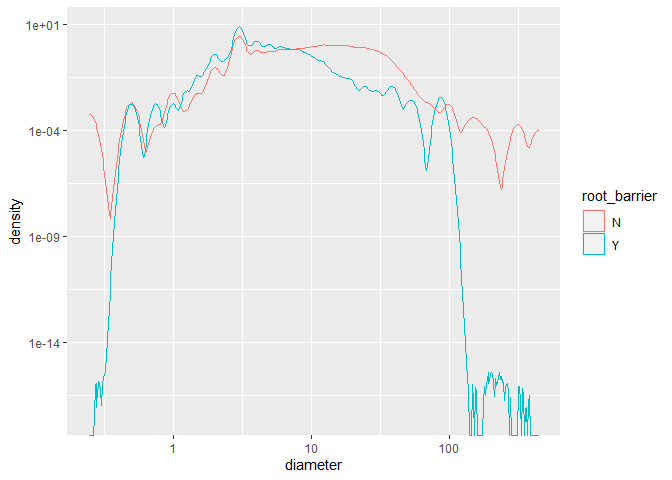

Mini Data-Analysis Deliverable 1
================

# Welcome to your (maybe) first-ever data analysis project!

And hopefully the first of many. Let’s get started:

1.  Install the [`datateachr`](https://github.com/UBC-MDS/datateachr)
    package by typing the following into your **R terminal**:

<!-- -->

    install.packages("devtools")
    devtools::install_github("UBC-MDS/datateachr")

2.  Load the packages below.

``` r
suppressPackageStartupMessages(library(datateachr))
suppressWarnings(suppressPackageStartupMessages(library(tidyverse)))
```

3.  Make a repository in the <https://github.com/stat545ubc-2022>
    Organization. You will be working with this repository for the
    entire data analysis project. You can either make it public, or make
    it private and add the TA’s and Lucy as collaborators. A link to
    help you create a private repository is available on the
    \#collaborative-project Slack channel.

# Instructions

## For Both Milestones

- Each milestone is worth 45 points. The number of points allocated to
  each task will be annotated within each deliverable. Tasks that are
  more challenging will often be allocated more points.

- 10 points will be allocated to the reproducibility, cleanliness, and
  coherence of the overall analysis. While the two milestones will be
  submitted as independent deliverables, the analysis itself is a
  continuum - think of it as two chapters to a story. Each chapter, or
  in this case, portion of your analysis, should be easily followed
  through by someone unfamiliar with the content.
  [Here](https://swcarpentry.github.io/r-novice-inflammation/06-best-practices-R/)
  is a good resource for what constitutes “good code”. Learning good
  coding practices early in your career will save you hassle later on!

## For Milestone 1

**To complete this milestone**, edit [this very `.Rmd`
file](https://raw.githubusercontent.com/UBC-STAT/stat545.stat.ubc.ca/master/content/mini-project/mini-project-1.Rmd)
directly. Fill in the sections that are tagged with
`<!--- start your work below --->`.

**To submit this milestone**, make sure to knit this `.Rmd` file to an
`.md` file by changing the YAML output settings from
`output: html_document` to `output: github_document`. Commit and push
all of your work to the mini-analysis GitHub repository you made
earlier, and tag a release on GitHub. Then, submit a link to your tagged
release on canvas.

**Points**: This milestone is worth 45 points: 43 for your analysis, 1
point for having your Milestone 1 document knit error-free, and 1 point
for tagging your release on Github.

# Learning Objectives

By the end of this milestone, you should:

- Become familiar with your dataset of choosing
- Select 4 questions that you would like to answer with your data
- Generate a reproducible and clear report using R Markdown
- Become familiar with manipulating and summarizing your data in tibbles
  using `dplyr`, with a research question in mind.

# Task 1: Choose your favorite dataset (10 points)

The `datateachr` package by Hayley Boyce and Jordan Bourak currently
composed of 7 semi-tidy datasets for educational purposes. Here is a
brief description of each dataset:

- *apt_buildings*: Acquired courtesy of The City of Toronto’s Open Data
  Portal. It currently has 3455 rows and 37 columns.

- *building_permits*: Acquired courtesy of The City of Vancouver’s Open
  Data Portal. It currently has 20680 rows and 14 columns.

- *cancer_sample*: Acquired courtesy of UCI Machine Learning Repository.
  It currently has 569 rows and 32 columns.

- *flow_sample*: Acquired courtesy of The Government of Canada’s
  Historical Hydrometric Database. It currently has 218 rows and 7
  columns.

- *parking_meters*: Acquired courtesy of The City of Vancouver’s Open
  Data Portal. It currently has 10032 rows and 22 columns.

- *steam_games*: Acquired courtesy of Kaggle. It currently has 40833
  rows and 21 columns.

- *vancouver_trees*: Acquired courtesy of The City of Vancouver’s Open
  Data Portal. It currently has 146611 rows and 20 columns.

**Things to keep in mind**

- We hope that this project will serve as practice for carrying our your
  own *independent* data analysis. Remember to comment your code, be
  explicit about what you are doing, and write notes in this markdown
  document when you feel that context is required. As you advance in the
  project, prompts and hints to do this will be diminished - it’ll be up
  to you!

- Before choosing a dataset, you should always keep in mind **your
  goal**, or in other ways, *what you wish to achieve with this data*.
  This mini data-analysis project focuses on *data wrangling*,
  *tidying*, and *visualization*. In short, it’s a way for you to get
  your feet wet with exploring data on your own.

And that is exactly the first thing that you will do!

1.1 Out of the 7 datasets available in the `datateachr` package, choose
**4** that appeal to you based on their description. Write your choices
below:

**Note**: We encourage you to use the ones in the `datateachr` package,
but if you have a dataset that you’d really like to use, you can include
it here. But, please check with a member of the teaching team to see
whether the dataset is of appropriate complexity. Also, include a
**brief** description of the dataset here to help the teaching team
understand your data.

<!-------------------------- Start your work below ---------------------------->

*1. cancer_sample*

*2. vancouver_trees*

*3. parking_meters*

*4. flow_sample*

<!----------------------------------------------------------------------------->

1.2 One way to narrowing down your selection is to *explore* the
datasets. Use your knowledge of dplyr to find out at least *3*
attributes about each of these datasets (an attribute is something such
as number of rows, variables, class type…). The goal here is to have an
idea of *what the data looks like*.

*Hint:* This is one of those times when you should think about the
cleanliness of your analysis. I added a single code chunk for you below,
but do you want to use more than one? Would you like to write more
comments outside of the code chunk?

<!-------------------------- Start your work below ---------------------------->

#### Notes on codes I used

glimpse() was used to understand the rows, columns, categories of data,
and get an idea of what the data looks like. summary() was used to get a
mathematical sense of the data - how large are the ranges, what are the
means/medians, etc. colSums(is.na()) is used to understand now many NAs
there are.

#### Cancer Sample

``` r
glimpse(cancer_sample)
```

    ## Rows: 569
    ## Columns: 32
    ## $ ID                      <dbl> 842302, 842517, 84300903, 84348301, 84358402, ~
    ## $ diagnosis               <chr> "M", "M", "M", "M", "M", "M", "M", "M", "M", "~
    ## $ radius_mean             <dbl> 17.990, 20.570, 19.690, 11.420, 20.290, 12.450~
    ## $ texture_mean            <dbl> 10.38, 17.77, 21.25, 20.38, 14.34, 15.70, 19.9~
    ## $ perimeter_mean          <dbl> 122.80, 132.90, 130.00, 77.58, 135.10, 82.57, ~
    ## $ area_mean               <dbl> 1001.0, 1326.0, 1203.0, 386.1, 1297.0, 477.1, ~
    ## $ smoothness_mean         <dbl> 0.11840, 0.08474, 0.10960, 0.14250, 0.10030, 0~
    ## $ compactness_mean        <dbl> 0.27760, 0.07864, 0.15990, 0.28390, 0.13280, 0~
    ## $ concavity_mean          <dbl> 0.30010, 0.08690, 0.19740, 0.24140, 0.19800, 0~
    ## $ concave_points_mean     <dbl> 0.14710, 0.07017, 0.12790, 0.10520, 0.10430, 0~
    ## $ symmetry_mean           <dbl> 0.2419, 0.1812, 0.2069, 0.2597, 0.1809, 0.2087~
    ## $ fractal_dimension_mean  <dbl> 0.07871, 0.05667, 0.05999, 0.09744, 0.05883, 0~
    ## $ radius_se               <dbl> 1.0950, 0.5435, 0.7456, 0.4956, 0.7572, 0.3345~
    ## $ texture_se              <dbl> 0.9053, 0.7339, 0.7869, 1.1560, 0.7813, 0.8902~
    ## $ perimeter_se            <dbl> 8.589, 3.398, 4.585, 3.445, 5.438, 2.217, 3.18~
    ## $ area_se                 <dbl> 153.40, 74.08, 94.03, 27.23, 94.44, 27.19, 53.~
    ## $ smoothness_se           <dbl> 0.006399, 0.005225, 0.006150, 0.009110, 0.0114~
    ## $ compactness_se          <dbl> 0.049040, 0.013080, 0.040060, 0.074580, 0.0246~
    ## $ concavity_se            <dbl> 0.05373, 0.01860, 0.03832, 0.05661, 0.05688, 0~
    ## $ concave_points_se       <dbl> 0.015870, 0.013400, 0.020580, 0.018670, 0.0188~
    ## $ symmetry_se             <dbl> 0.03003, 0.01389, 0.02250, 0.05963, 0.01756, 0~
    ## $ fractal_dimension_se    <dbl> 0.006193, 0.003532, 0.004571, 0.009208, 0.0051~
    ## $ radius_worst            <dbl> 25.38, 24.99, 23.57, 14.91, 22.54, 15.47, 22.8~
    ## $ texture_worst           <dbl> 17.33, 23.41, 25.53, 26.50, 16.67, 23.75, 27.6~
    ## $ perimeter_worst         <dbl> 184.60, 158.80, 152.50, 98.87, 152.20, 103.40,~
    ## $ area_worst              <dbl> 2019.0, 1956.0, 1709.0, 567.7, 1575.0, 741.6, ~
    ## $ smoothness_worst        <dbl> 0.1622, 0.1238, 0.1444, 0.2098, 0.1374, 0.1791~
    ## $ compactness_worst       <dbl> 0.6656, 0.1866, 0.4245, 0.8663, 0.2050, 0.5249~
    ## $ concavity_worst         <dbl> 0.71190, 0.24160, 0.45040, 0.68690, 0.40000, 0~
    ## $ concave_points_worst    <dbl> 0.26540, 0.18600, 0.24300, 0.25750, 0.16250, 0~
    ## $ symmetry_worst          <dbl> 0.4601, 0.2750, 0.3613, 0.6638, 0.2364, 0.3985~
    ## $ fractal_dimension_worst <dbl> 0.11890, 0.08902, 0.08758, 0.17300, 0.07678, 0~

``` r
summary(cancer_sample)
```

    ##        ID             diagnosis          radius_mean      texture_mean  
    ##  Min.   :     8670   Length:569         Min.   : 6.981   Min.   : 9.71  
    ##  1st Qu.:   869218   Class :character   1st Qu.:11.700   1st Qu.:16.17  
    ##  Median :   906024   Mode  :character   Median :13.370   Median :18.84  
    ##  Mean   : 30371831                      Mean   :14.127   Mean   :19.29  
    ##  3rd Qu.:  8813129                      3rd Qu.:15.780   3rd Qu.:21.80  
    ##  Max.   :911320502                      Max.   :28.110   Max.   :39.28  
    ##  perimeter_mean     area_mean      smoothness_mean   compactness_mean 
    ##  Min.   : 43.79   Min.   : 143.5   Min.   :0.05263   Min.   :0.01938  
    ##  1st Qu.: 75.17   1st Qu.: 420.3   1st Qu.:0.08637   1st Qu.:0.06492  
    ##  Median : 86.24   Median : 551.1   Median :0.09587   Median :0.09263  
    ##  Mean   : 91.97   Mean   : 654.9   Mean   :0.09636   Mean   :0.10434  
    ##  3rd Qu.:104.10   3rd Qu.: 782.7   3rd Qu.:0.10530   3rd Qu.:0.13040  
    ##  Max.   :188.50   Max.   :2501.0   Max.   :0.16340   Max.   :0.34540  
    ##  concavity_mean    concave_points_mean symmetry_mean    fractal_dimension_mean
    ##  Min.   :0.00000   Min.   :0.00000     Min.   :0.1060   Min.   :0.04996       
    ##  1st Qu.:0.02956   1st Qu.:0.02031     1st Qu.:0.1619   1st Qu.:0.05770       
    ##  Median :0.06154   Median :0.03350     Median :0.1792   Median :0.06154       
    ##  Mean   :0.08880   Mean   :0.04892     Mean   :0.1812   Mean   :0.06280       
    ##  3rd Qu.:0.13070   3rd Qu.:0.07400     3rd Qu.:0.1957   3rd Qu.:0.06612       
    ##  Max.   :0.42680   Max.   :0.20120     Max.   :0.3040   Max.   :0.09744       
    ##    radius_se        texture_se      perimeter_se       area_se       
    ##  Min.   :0.1115   Min.   :0.3602   Min.   : 0.757   Min.   :  6.802  
    ##  1st Qu.:0.2324   1st Qu.:0.8339   1st Qu.: 1.606   1st Qu.: 17.850  
    ##  Median :0.3242   Median :1.1080   Median : 2.287   Median : 24.530  
    ##  Mean   :0.4052   Mean   :1.2169   Mean   : 2.866   Mean   : 40.337  
    ##  3rd Qu.:0.4789   3rd Qu.:1.4740   3rd Qu.: 3.357   3rd Qu.: 45.190  
    ##  Max.   :2.8730   Max.   :4.8850   Max.   :21.980   Max.   :542.200  
    ##  smoothness_se      compactness_se      concavity_se     concave_points_se 
    ##  Min.   :0.001713   Min.   :0.002252   Min.   :0.00000   Min.   :0.000000  
    ##  1st Qu.:0.005169   1st Qu.:0.013080   1st Qu.:0.01509   1st Qu.:0.007638  
    ##  Median :0.006380   Median :0.020450   Median :0.02589   Median :0.010930  
    ##  Mean   :0.007041   Mean   :0.025478   Mean   :0.03189   Mean   :0.011796  
    ##  3rd Qu.:0.008146   3rd Qu.:0.032450   3rd Qu.:0.04205   3rd Qu.:0.014710  
    ##  Max.   :0.031130   Max.   :0.135400   Max.   :0.39600   Max.   :0.052790  
    ##   symmetry_se       fractal_dimension_se  radius_worst   texture_worst  
    ##  Min.   :0.007882   Min.   :0.0008948    Min.   : 7.93   Min.   :12.02  
    ##  1st Qu.:0.015160   1st Qu.:0.0022480    1st Qu.:13.01   1st Qu.:21.08  
    ##  Median :0.018730   Median :0.0031870    Median :14.97   Median :25.41  
    ##  Mean   :0.020542   Mean   :0.0037949    Mean   :16.27   Mean   :25.68  
    ##  3rd Qu.:0.023480   3rd Qu.:0.0045580    3rd Qu.:18.79   3rd Qu.:29.72  
    ##  Max.   :0.078950   Max.   :0.0298400    Max.   :36.04   Max.   :49.54  
    ##  perimeter_worst    area_worst     smoothness_worst  compactness_worst
    ##  Min.   : 50.41   Min.   : 185.2   Min.   :0.07117   Min.   :0.02729  
    ##  1st Qu.: 84.11   1st Qu.: 515.3   1st Qu.:0.11660   1st Qu.:0.14720  
    ##  Median : 97.66   Median : 686.5   Median :0.13130   Median :0.21190  
    ##  Mean   :107.26   Mean   : 880.6   Mean   :0.13237   Mean   :0.25427  
    ##  3rd Qu.:125.40   3rd Qu.:1084.0   3rd Qu.:0.14600   3rd Qu.:0.33910  
    ##  Max.   :251.20   Max.   :4254.0   Max.   :0.22260   Max.   :1.05800  
    ##  concavity_worst  concave_points_worst symmetry_worst   fractal_dimension_worst
    ##  Min.   :0.0000   Min.   :0.00000      Min.   :0.1565   Min.   :0.05504        
    ##  1st Qu.:0.1145   1st Qu.:0.06493      1st Qu.:0.2504   1st Qu.:0.07146        
    ##  Median :0.2267   Median :0.09993      Median :0.2822   Median :0.08004        
    ##  Mean   :0.2722   Mean   :0.11461      Mean   :0.2901   Mean   :0.08395        
    ##  3rd Qu.:0.3829   3rd Qu.:0.16140      3rd Qu.:0.3179   3rd Qu.:0.09208        
    ##  Max.   :1.2520   Max.   :0.29100      Max.   :0.6638   Max.   :0.20750

``` r
colSums(is.na(cancer_sample))
```

    ##                      ID               diagnosis             radius_mean 
    ##                       0                       0                       0 
    ##            texture_mean          perimeter_mean               area_mean 
    ##                       0                       0                       0 
    ##         smoothness_mean        compactness_mean          concavity_mean 
    ##                       0                       0                       0 
    ##     concave_points_mean           symmetry_mean  fractal_dimension_mean 
    ##                       0                       0                       0 
    ##               radius_se              texture_se            perimeter_se 
    ##                       0                       0                       0 
    ##                 area_se           smoothness_se          compactness_se 
    ##                       0                       0                       0 
    ##            concavity_se       concave_points_se             symmetry_se 
    ##                       0                       0                       0 
    ##    fractal_dimension_se            radius_worst           texture_worst 
    ##                       0                       0                       0 
    ##         perimeter_worst              area_worst        smoothness_worst 
    ##                       0                       0                       0 
    ##       compactness_worst         concavity_worst    concave_points_worst 
    ##                       0                       0                       0 
    ##          symmetry_worst fractal_dimension_worst 
    ##                       0                       0

- There are 569 rows and 32 columns. Most of the columns are numeric; it
  looks like they are continuous (not categorical numbers). Some of the
  values have a really large spread. There are no NA values. I’m not
  super familiar with the information in the graph - what does
  “compactness_worst” mean, for example?

#### Vancouver trees

``` r
glimpse(vancouver_trees)
```

    ## Rows: 146,611
    ## Columns: 20
    ## $ tree_id            <dbl> 149556, 149563, 149579, 149590, 149604, 149616, 149~
    ## $ civic_number       <dbl> 494, 450, 4994, 858, 5032, 585, 4909, 4925, 4969, 7~
    ## $ std_street         <chr> "W 58TH AV", "W 58TH AV", "WINDSOR ST", "E 39TH AV"~
    ## $ genus_name         <chr> "ULMUS", "ZELKOVA", "STYRAX", "FRAXINUS", "ACER", "~
    ## $ species_name       <chr> "AMERICANA", "SERRATA", "JAPONICA", "AMERICANA", "C~
    ## $ cultivar_name      <chr> "BRANDON", NA, NA, "AUTUMN APPLAUSE", NA, "CHANTICL~
    ## $ common_name        <chr> "BRANDON ELM", "JAPANESE ZELKOVA", "JAPANESE SNOWBE~
    ## $ assigned           <chr> "N", "N", "N", "Y", "N", "N", "N", "N", "N", "N", "~
    ## $ root_barrier       <chr> "N", "N", "N", "N", "N", "N", "N", "N", "N", "N", "~
    ## $ plant_area         <chr> "N", "N", "4", "4", "4", "B", "6", "6", "3", "3", "~
    ## $ on_street_block    <dbl> 400, 400, 4900, 800, 5000, 500, 4900, 4900, 4900, 7~
    ## $ on_street          <chr> "W 58TH AV", "W 58TH AV", "WINDSOR ST", "E 39TH AV"~
    ## $ neighbourhood_name <chr> "MARPOLE", "MARPOLE", "KENSINGTON-CEDAR COTTAGE", "~
    ## $ street_side_name   <chr> "EVEN", "EVEN", "EVEN", "EVEN", "EVEN", "ODD", "ODD~
    ## $ height_range_id    <dbl> 2, 4, 3, 4, 2, 2, 3, 3, 2, 2, 2, 5, 3, 2, 2, 2, 2, ~
    ## $ diameter           <dbl> 10.00, 10.00, 4.00, 18.00, 9.00, 5.00, 15.00, 14.00~
    ## $ curb               <chr> "N", "N", "Y", "Y", "Y", "Y", "Y", "Y", "Y", "Y", "~
    ## $ date_planted       <date> 1999-01-13, 1996-05-31, 1993-11-22, 1996-04-29, 19~
    ## $ longitude          <dbl> -123.1161, -123.1147, -123.0846, -123.0870, -123.08~
    ## $ latitude           <dbl> 49.21776, 49.21776, 49.23938, 49.23469, 49.23894, 4~

``` r
summary(vancouver_trees)
```

    ##     tree_id        civic_number    std_street         genus_name       
    ##  Min.   :    12   Min.   :    0   Length:146611      Length:146611     
    ##  1st Qu.: 65464   1st Qu.: 1306   Class :character   Class :character  
    ##  Median :134903   Median : 2604   Mode  :character   Mode  :character  
    ##  Mean   :131892   Mean   : 2937                                        
    ##  3rd Qu.:194450   3rd Qu.: 4005                                        
    ##  Max.   :266203   Max.   :17888                                        
    ##                                                                        
    ##  species_name       cultivar_name      common_name          assigned        
    ##  Length:146611      Length:146611      Length:146611      Length:146611     
    ##  Class :character   Class :character   Class :character   Class :character  
    ##  Mode  :character   Mode  :character   Mode  :character   Mode  :character  
    ##                                                                             
    ##                                                                             
    ##                                                                             
    ##                                                                             
    ##  root_barrier        plant_area        on_street_block  on_street        
    ##  Length:146611      Length:146611      Min.   :   0    Length:146611     
    ##  Class :character   Class :character   1st Qu.:1300    Class :character  
    ##  Mode  :character   Mode  :character   Median :2600    Mode  :character  
    ##                                        Mean   :2909                      
    ##                                        3rd Qu.:4000                      
    ##                                        Max.   :9900                      
    ##                                                                          
    ##  neighbourhood_name street_side_name   height_range_id     diameter     
    ##  Length:146611      Length:146611      Min.   : 0.000   Min.   :  0.00  
    ##  Class :character   Class :character   1st Qu.: 1.000   1st Qu.:  3.50  
    ##  Mode  :character   Mode  :character   Median : 2.000   Median :  9.00  
    ##                                        Mean   : 2.627   Mean   : 11.49  
    ##                                        3rd Qu.: 4.000   3rd Qu.: 16.50  
    ##                                        Max.   :10.000   Max.   :435.00  
    ##                                                                         
    ##      curb            date_planted          longitude         latitude    
    ##  Length:146611      Min.   :1989-10-27   Min.   :-123.2   Min.   :49.20  
    ##  Class :character   1st Qu.:1998-02-23   1st Qu.:-123.1   1st Qu.:49.23  
    ##  Mode  :character   Median :2004-01-28   Median :-123.1   Median :49.25  
    ##                     Mean   :2004-04-07   Mean   :-123.1   Mean   :49.25  
    ##                     3rd Qu.:2010-03-02   3rd Qu.:-123.1   3rd Qu.:49.26  
    ##                     Max.   :2019-07-03   Max.   :-123.0   Max.   :49.29  
    ##                     NA's   :76548        NA's   :22771    NA's   :22771

``` r
colSums(is.na(vancouver_trees))
```

    ##            tree_id       civic_number         std_street         genus_name 
    ##                  0                  0                  0                  0 
    ##       species_name      cultivar_name        common_name           assigned 
    ##                  0              67559                  0                  0 
    ##       root_barrier         plant_area    on_street_block          on_street 
    ##                  0               1486                  0                  0 
    ## neighbourhood_name   street_side_name    height_range_id           diameter 
    ##                  0                  0                  0                  0 
    ##               curb       date_planted          longitude           latitude 
    ##                  0              76548              22771              22771

- There are 146,611 rows and 20 columns. Most of the values are
  characters, and a few are dichotomous or categorical (height_range
  seems to have heights as numeric categories, and while civic_number is
  numeric it’s not like a measurement of something). There is also a
  date category. As a result there’s not much to learn from the
  summary() function, except that there are a lot of NA values in some
  of the columns (cultivar, date, plant area, longitude, and latitude).
  I can more or less figure out what is going on with this data based on
  the column names, and I found more information online from the City of
  Vancouver about what the different values mean.

#### Parking Meters

``` r
glimpse(parking_meters)
```

    ## Rows: 10,032
    ## Columns: 22
    ## $ meter_head     <chr> "Twin", "Pay Station", "Twin", "Single", "Twin", "Twin"~
    ## $ r_mf_9a_6p     <chr> "$2.00", "$1.00", "$1.00", "$1.00", "$2.00", "$2.00", "~
    ## $ r_mf_6p_10     <chr> "$4.00", "$1.00", "$1.00", "$1.00", "$1.00", "$1.00", "~
    ## $ r_sa_9a_6p     <chr> "$2.00", "$1.00", "$1.00", "$1.00", "$2.00", "$2.00", "~
    ## $ r_sa_6p_10     <chr> "$4.00", "$1.00", "$1.00", "$1.00", "$1.00", "$1.00", "~
    ## $ r_su_9a_6p     <chr> "$2.00", "$1.00", "$1.00", "$1.00", "$2.00", "$2.00", "~
    ## $ r_su_6p_10     <chr> "$4.00", "$1.00", "$1.00", "$1.00", "$1.00", "$1.00", "~
    ## $ rate_misc      <chr> NA, "$ .50", NA, NA, NA, NA, NA, NA, NA, NA, NA, NA, NA~
    ## $ time_in_effect <chr> "METER IN EFFECT: 9:00 AM TO 10:00 PM", "METER IN EFFEC~
    ## $ t_mf_9a_6p     <chr> "2 Hr", "10 Hrs", "2 Hr", "2 Hr", "2 Hr", "3 Hr", "2 Hr~
    ## $ t_mf_6p_10     <chr> "4 Hr", "10 Hrs", "4 Hr", "4 Hr", "4 Hr", "4 Hr", "4 Hr~
    ## $ t_sa_9a_6p     <chr> "2 Hr", "10 Hrs", "2 Hr", "2 Hr", "2 Hr", "3 Hr", "2 Hr~
    ## $ t_sa_6p_10     <chr> "4 Hr", "10 Hrs", "4 Hr", "4 Hr", "4 Hr", "4 Hr", "4 Hr~
    ## $ t_su_9a_6p     <chr> "2 Hr", "10 Hrs", "2 Hr", "2 Hr", "2 Hr", "3 Hr", "2 Hr~
    ## $ t_su_6p_10     <chr> "4 Hr", "10 Hrs", "4 Hr", "4 Hr", "4 Hr", "4 Hr", "4 Hr~
    ## $ time_misc      <chr> NA, "No Time Limit", NA, NA, NA, NA, NA, NA, NA, NA, NA~
    ## $ credit_card    <chr> "No", "Yes", "No", "No", "No", "No", "No", "No", "No", ~
    ## $ pay_phone      <chr> "66890", "59916", "57042", "57159", "51104", "60868", "~
    ## $ longitude      <dbl> -123.1289, -123.0982, -123.1013, -123.1862, -123.1278, ~
    ## $ latitude       <dbl> 49.28690, 49.27215, 49.25468, 49.26341, 49.26354, 49.27~
    ## $ geo_local_area <chr> "West End", "Strathcona", "Riley Park", "West Point Gre~
    ## $ meter_id       <chr> "670805", "471405", "C80145", "D03704", "301023", "5913~

``` r
summary(parking_meters)
```

    ##   meter_head         r_mf_9a_6p         r_mf_6p_10         r_sa_9a_6p       
    ##  Length:10032       Length:10032       Length:10032       Length:10032      
    ##  Class :character   Class :character   Class :character   Class :character  
    ##  Mode  :character   Mode  :character   Mode  :character   Mode  :character  
    ##                                                                             
    ##                                                                             
    ##                                                                             
    ##   r_sa_6p_10         r_su_9a_6p         r_su_6p_10         rate_misc        
    ##  Length:10032       Length:10032       Length:10032       Length:10032      
    ##  Class :character   Class :character   Class :character   Class :character  
    ##  Mode  :character   Mode  :character   Mode  :character   Mode  :character  
    ##                                                                             
    ##                                                                             
    ##                                                                             
    ##  time_in_effect      t_mf_9a_6p         t_mf_6p_10         t_sa_9a_6p       
    ##  Length:10032       Length:10032       Length:10032       Length:10032      
    ##  Class :character   Class :character   Class :character   Class :character  
    ##  Mode  :character   Mode  :character   Mode  :character   Mode  :character  
    ##                                                                             
    ##                                                                             
    ##                                                                             
    ##   t_sa_6p_10         t_su_9a_6p         t_su_6p_10         time_misc        
    ##  Length:10032       Length:10032       Length:10032       Length:10032      
    ##  Class :character   Class :character   Class :character   Class :character  
    ##  Mode  :character   Mode  :character   Mode  :character   Mode  :character  
    ##                                                                             
    ##                                                                             
    ##                                                                             
    ##  credit_card         pay_phone           longitude         latitude    
    ##  Length:10032       Length:10032       Min.   :-123.2   Min.   :49.21  
    ##  Class :character   Class :character   1st Qu.:-123.1   1st Qu.:49.26  
    ##  Mode  :character   Mode  :character   Median :-123.1   Median :49.27  
    ##                                        Mean   :-123.1   Mean   :49.27  
    ##                                        3rd Qu.:-123.1   3rd Qu.:49.28  
    ##                                        Max.   :-123.0   Max.   :49.29  
    ##  geo_local_area       meter_id        
    ##  Length:10032       Length:10032      
    ##  Class :character   Class :character  
    ##  Mode  :character   Mode  :character  
    ##                                       
    ##                                       
    ## 

``` r
colSums(is.na(parking_meters))
```

    ##     meter_head     r_mf_9a_6p     r_mf_6p_10     r_sa_9a_6p     r_sa_6p_10 
    ##              0             20             20             23             20 
    ##     r_su_9a_6p     r_su_6p_10      rate_misc time_in_effect     t_mf_9a_6p 
    ##             23             20           9218             37             29 
    ##     t_mf_6p_10     t_sa_9a_6p     t_sa_6p_10     t_su_9a_6p     t_su_6p_10 
    ##             24             22             24             22             23 
    ##      time_misc    credit_card      pay_phone      longitude       latitude 
    ##           9551             16              4              0              0 
    ## geo_local_area       meter_id 
    ##              0              0

- There are 10,032 rows and 22 columns. Most of the columns are
  considered “character” though some could probably be changed to
  numeric since there is a lot that have to do with time and money.
  There are some dichotomous variables. The data is stored in this sheet
  really weird because of that, and data analysis will be hard without
  doing a lot of cleaning. There are a handful of NAs in most of the
  data columns, but a lot of in the “rate_misc” and “time_misc”. I can
  more or less figure out what is going on with the data by looking at
  the column names.

#### Flow Sample

``` r
glimpse(flow_sample)
```

    ## Rows: 218
    ## Columns: 7
    ## $ station_id   <chr> "05BB001", "05BB001", "05BB001", "05BB001", "05BB001", "0~
    ## $ year         <dbl> 1909, 1910, 1911, 1912, 1913, 1914, 1915, 1916, 1917, 191~
    ## $ extreme_type <chr> "maximum", "maximum", "maximum", "maximum", "maximum", "m~
    ## $ month        <dbl> 7, 6, 6, 8, 6, 6, 6, 6, 6, 6, 6, 7, 6, 6, 6, 7, 5, 7, 6, ~
    ## $ day          <dbl> 7, 12, 14, 25, 11, 18, 27, 20, 17, 15, 22, 3, 9, 5, 14, 5~
    ## $ flow         <dbl> 314, 230, 264, 174, 232, 214, 236, 309, 174, 345, 185, 24~
    ## $ sym          <chr> NA, NA, NA, NA, NA, NA, NA, NA, NA, NA, NA, NA, NA, NA, N~

``` r
summary(flow_sample)
```

    ##   station_id             year      extreme_type           month       
    ##  Length:218         Min.   :1909   Length:218         Min.   : 1.000  
    ##  Class :character   1st Qu.:1936   Class :character   1st Qu.: 3.000  
    ##  Mode  :character   Median :1963   Mode  :character   Median : 6.000  
    ##                     Mean   :1963                      Mean   : 5.046  
    ##                     3rd Qu.:1990                      3rd Qu.: 6.000  
    ##                     Max.   :2018                      Max.   :12.000  
    ##                                                       NA's   :2       
    ##       day             flow            sym           
    ##  Min.   : 1.00   Min.   :  3.62   Length:218        
    ##  1st Qu.: 8.00   1st Qu.:  6.18   Class :character  
    ##  Median :17.00   Median :114.00   Mode  :character  
    ##  Mean   :16.24   Mean   :110.13                     
    ##  3rd Qu.:25.00   3rd Qu.:204.25                     
    ##  Max.   :31.00   Max.   :466.00                     
    ##  NA's   :2       NA's   :2

``` r
colSums(is.na(flow_sample))
```

    ##   station_id         year extreme_type        month          day         flow 
    ##            0            0            0            2            2            2 
    ##          sym 
    ##          119

- There are 218 rows and 7 columns. The year is not stored as a date
  column. Most of the columns are numeric, although the month-date-year
  are separate and not considered dates which may make data analysis
  hard. “Flow” seems to be the only continuous numeric/measurements
  column. As a result there’s not much to be learned from the summary()
  function. There’s not many NA’s except in the “sym” column. I think if
  I knew more about this data I could figure out what the columns mean
  pretty easy since there’s so few of them, but I’m not sure what “sym”
  and “extreme_type” means and what “flow” really means.

<!----------------------------------------------------------------------------->

1.3 Now that you’ve explored the 4 datasets that you were initially most
interested in, let’s narrow it down to 2. What lead you to choose these
2? Briefly explain your choices below, and feel free to include any code
in your explanation.

<!-------------------------- Start your work below ---------------------------->

- I am going to be working with vancouver_trees and parking_meters
  because I can pretty easily understand the data based on the headers,
  and because they have a varitety of different column types. I also
  love trees and regularly use parking meters so I feel more “connected”
  to the data.  
  <!----------------------------------------------------------------------------->

1.4 Time for the final decision! Going back to the beginning, it’s
important to have an *end goal* in mind. For example, if I had chosen
the `titanic` dataset for my project, I might’ve wanted to explore the
relationship between survival and other variables. Try to think of 1
research question that you would want to answer with each dataset. Note
them down below, and make your final choice based on what seems more
interesting to you!

<!-------------------------- Start your work below ---------------------------->

- For the parking meter data: what days/times make the most money for
  the city?

- For the trees dataset: how are the different tree species distributed
  accross the neighborhoods?

- I’m going to look into the tree species!
  <!----------------------------------------------------------------------------->

# Important note

Read Tasks 2 and 3 *fully* before starting to complete either of them.
Probably also a good point to grab a coffee to get ready for the fun
part!

This project is semi-guided, but meant to be *independent*. For this
reason, you will complete tasks 2 and 3 below (under the **START HERE**
mark) as if you were writing your own exploratory data analysis report,
and this guidance never existed! Feel free to add a brief introduction
section to your project, format the document with markdown syntax as you
deem appropriate, and structure the analysis as you deem appropriate.
Remember, marks will be awarded for completion of the 4 tasks, but 10
points of the whole project are allocated to a reproducible and clean
analysis. If you feel lost, you can find a sample data analysis
[here](https://www.kaggle.com/headsortails/tidy-titarnic) to have a
better idea. However, bear in mind that it is **just an example** and
you will not be required to have that level of complexity in your
project.

# Task 2: Exploring your dataset (15 points)

If we rewind and go back to the learning objectives, you’ll see that by
the end of this deliverable, you should have formulated *4* research
questions about your data that you may want to answer during your
project. However, it may be handy to do some more exploration on your
dataset of choice before creating these questions - by looking at the
data, you may get more ideas. **Before you start this task, read all
instructions carefully until you reach START HERE under Task 3**.

2.1 Complete *4 out of the following 8 exercises* to dive deeper into
your data. All datasets are different and therefore, not all of these
tasks may make sense for your data - which is why you should only answer
*4*. Use *dplyr* and *ggplot*.

1.  Plot the distribution of a numeric variable.
2.  Create a new variable based on other variables in your data (only if
    it makes sense)
3.  Investigate how many missing values there are per variable. Can you
    find a way to plot this?
4.  Explore the relationship between 2 variables in a plot.
5.  Filter observations in your data according to your own criteria.
    Think of what you’d like to explore - again, if this was the
    `titanic` dataset, I may want to narrow my search down to passengers
    born in a particular year…
6.  Use a boxplot to look at the frequency of different observations
    within a single variable. You can do this for more than one variable
    if you wish!
7.  Make a new tibble with a subset of your data, with variables and
    observations that you are interested in exploring.
8.  Use a density plot to explore any of your variables (that are
    suitable for this type of plot).

2.2 For each of the 4 exercises that you complete, provide a *brief
explanation* of why you chose that exercise in relation to your data (in
other words, why does it make sense to do that?), and sufficient
comments for a reader to understand your reasoning and code.

<!-------------------------- Start your work below ---------------------------->

#### My Analysis Task 2

First, I noticed this is a HUGE data set, so lets see how many unique
values there are in each category so I can get a better feel for what
the data is like; if it turns out there is a huge variety of categorical
variables, it might make more sense to pick specific neighborhoods,
trees, people, etc. to look at so that my data doesn’t get too unwieldy
and so my graphs look nice. I’ll do this by making a new tibble that
summarizes the number of unique values that are in each of our columns.

``` r
number_na <- vancouver_trees
number_na %>%
summarize_all(list(~n_distinct(.))) %>%
  print.data.frame()
```

    ##   tree_id civic_number std_street genus_name species_name cultivar_name
    ## 1  146611         8349        805         97          283           294
    ##   common_name assigned root_barrier plant_area on_street_block on_street
    ## 1         634        2            2         49             433       812
    ##   neighbourhood_name street_side_name height_range_id diameter curb
    ## 1                 22                6              11      520    2
    ##   date_planted longitude latitude
    ## 1         3995     77228    36685

Looks like we have 22 neighborhoods, 294 cultivars, 283 species names,
and whopping 634 “common names”. That’s a lot of data.

I’m not a biologist so I’m not sure if each species name is unqiue (for
instance, is there one species name shared between two different
genus’s?) So I’m going to use the “mutate” function to make a new
genus_species column and figure out how many unique values there are in
that column to see the total number of species in the data using
n_distinct.

``` r
vancouver_trees <- vancouver_trees %>% 
  unite('genus_species', c('genus_name', 'species_name'), 
        remove = FALSE)

n_distinct(vancouver_trees$genus_species)
```

    ## [1] 361

There’s 361 unique species of trees in the data!

Maybe it makes more sense to try to limit our data on a
neighborhood-by-neighborhood basis, since there’s only 22 neighborhoods.
Lets see how many unique species there are in each one.

``` r
neighborhood_data <- vancouver_trees %>% 
  group_by(neighbourhood_name) %>%
  summarize(n_distinct(genus_species)) %>% 
  print.data.frame()
```

    ##          neighbourhood_name n_distinct(genus_species)
    ## 1             ARBUTUS-RIDGE                       146
    ## 2                  DOWNTOWN                        94
    ## 3         DUNBAR-SOUTHLANDS                       207
    ## 4                  FAIRVIEW                       143
    ## 5        GRANDVIEW-WOODLAND                       183
    ## 6          HASTINGS-SUNRISE                       213
    ## 7  KENSINGTON-CEDAR COTTAGE                       195
    ## 8                KERRISDALE                       173
    ## 9                 KILLARNEY                       144
    ## 10                KITSILANO                       214
    ## 11                  MARPOLE                       168
    ## 12           MOUNT PLEASANT                       162
    ## 13                 OAKRIDGE                       152
    ## 14      RENFREW-COLLINGWOOD                       214
    ## 15               RILEY PARK                       189
    ## 16              SHAUGHNESSY                       179
    ## 17             SOUTH CAMBIE                       145
    ## 18               STRATHCONA                       141
    ## 19                   SUNSET                       180
    ## 20      VICTORIA-FRASERVIEW                       162
    ## 21                 WEST END                       143
    ## 22          WEST POINT GREY                       166

Interesting! Looks like downtown has the fewest species, Kits and
Renfrew-collingwood have the most, but overall the data seems
surprisngly even.

This is still a lot of data to work with, and I’m interested in some
individual tree information. My favorite tree is the japanese maple -
Acer palmatum. So lets use that when trying to figure out stuff about
trees.

Let’s pull these out and see how big their trunks are using a density
plot of the diameter. I know that they’re the only tree in this data set
with the species name “Palmatum” so I can just use that instead of
typing extra to pull out from the genus_species name.

``` r
japanese_maple <- vancouver_trees %>%
  filter(species_name == "PALMATUM") 
  
japanese_maple %>% 
ggplot(aes(diameter)) + 
geom_density()
```

<!-- -->

Where are the widest ones? We’ll do a boxplot of the neighborhoods and
diameter to see.

``` r
  japanese_maple %>%
  ggplot(aes(neighbourhood_name, diameter)) + 
  geom_boxplot() + 
    coord_flip()
```

<!-- -->

The west end seems to have the widest maples in general, but there is a
very big one in kits!

what about the tallest? (the box plot isn’t perfect for this since it’s
a height category that corresponds to the height instead of a continuous
height, but this should be good enough to give us an idea)

``` r
      japanese_maple %>%
  ggplot(aes(neighbourhood_name, height_range_id)) + 
  geom_boxplot() + 
    coord_flip()
```

<!-- -->

Generally kerrisdale, but there is also a very tall one in Shaughnessy.
How interesting that the tallest doesn’t seem to be the widest.

How tall do they tend to be? We can use a histogram to figure that out.

``` r
japanese_maple %>% 
ggplot(aes(height_range_id)) + 
geom_histogram()
```

    ## `stat_bin()` using `bins = 30`. Pick better value with `binwidth`.

<!-- -->

I know the values are 0-10 for every 10 feet, and 1 = 10-20 feet, etc.
So looks like most are around 10-20 feet.

<!----------------------------------------------------------------------------->

# Task 3: Write your research questions (5 points)

So far, you have chosen a dataset and gotten familiar with it through
exploring the data. Now it’s time to figure out 4 research questions
that you would like to answer with your data! Write the 4 questions and
any additional comments at the end of this deliverable. These questions
are not necessarily set in stone - TAs will review them and give you
feedback; therefore, you may choose to pursue them as they are for the
rest of the project, or make modifications!

<!--- *****START HERE***** --->

1.  Is there a relationship between species diversity and number of
    trees in each neighborhood?
2.  is there a relationship between the presence of a root barrier and
    the diameter of the tree?  
3.  What was the proportion of Japanese Maple trees compared to all
    trees planted that year?
4.  What exactly is the relationship between height and diameter of a
    japanese maple?
    <!----------------------------------------------------------------------------->

# Task 4: Process and summarize your data (13 points)

From Task 2, you should have an idea of the basic structure of your
dataset (e.g. number of rows and columns, class types, etc.). Here, we
will start investigating your data more in-depth using various data
manipulation functions.

### 1.1 (10 points)

Now, for each of your four research questions, choose one task from
options 1-4 (summarizing), and one other task from 4-8 (graphing). You
should have 2 tasks done for each research question (8 total). Make sure
it makes sense to do them! (e.g. don’t use a numerical variables for a
task that needs a categorical variable.). Comment on why each task helps
(or doesn’t!) answer the corresponding research question.

Ensure that the output of each operation is printed!

**Summarizing:**

1.  Compute the *range*, *mean*, and *two other summary statistics* of
    **one numerical variable** across the groups of **one categorical
    variable** from your data.
2.  Compute the number of observations for at least one of your
    categorical variables. Do not use the function `table()`!
3.  Create a categorical variable with 3 or more groups from an existing
    numerical variable. You can use this new variable in the other
    tasks! *An example: age in years into “child, teen, adult, senior”.*
4.  Based on two categorical variables, calculate two summary statistics
    of your choosing.

**Graphing:**

5.  Create a graph out of summarized variables that has at least two
    geom layers.
6.  Create a graph of your choosing, make one of the axes logarithmic,
    and format the axes labels so that they are “pretty” or easier to
    read.
7.  Make a graph where it makes sense to customize the alpha
    transparency.
8.  Create 3 histograms out of summarized variables, with each histogram
    having different sized bins. Pick the “best” one and explain why it
    is the best.

Make sure it’s clear what research question you are doing each operation
for!

<!------------------------- Start your work below ----------------------------->

#### My Analysis Task 4

**1. Is there a relationship between species diversity and number of
trees in each neighborhood?**

We already have a small data frame for the number of distinct species in
each neighborhood (neighborhood_data), so lets make a new one that shows
the number of trees in each neighborhood, combine it with our
neighborhood_data, then delete the extraneous data frame to keep things
tidy.

``` r
number_trees <- vancouver_trees %>% 
  group_by(neighbourhood_name) %>%
  summarize(trees_count = sum(neighbourhood_name !="X")) 

neighborhood_data <- neighborhood_data %>%
  add_column(tree_count = number_trees$trees_count) %>%
print()
```

    ## # A tibble: 22 x 3
    ##    neighbourhood_name       `n_distinct(genus_species)` tree_count
    ##    <chr>                                          <int>      <int>
    ##  1 ARBUTUS-RIDGE                                    146       5169
    ##  2 DOWNTOWN                                          94       5159
    ##  3 DUNBAR-SOUTHLANDS                                207       9415
    ##  4 FAIRVIEW                                         143       4002
    ##  5 GRANDVIEW-WOODLAND                               183       6703
    ##  6 HASTINGS-SUNRISE                                 213      10547
    ##  7 KENSINGTON-CEDAR COTTAGE                         195      11042
    ##  8 KERRISDALE                                       173       6936
    ##  9 KILLARNEY                                        144       6148
    ## 10 KITSILANO                                        214       8115
    ## # ... with 12 more rows

``` r
rm(number_trees)
```

Let’s make some histograms and see what bin sizes make more sense.

First for the tree count:

``` r
ggplot(neighborhood_data, aes(tree_count)) + 
geom_histogram(bins = 5)
```

<!-- -->

``` r
ggplot(neighborhood_data, aes(tree_count)) + 
geom_histogram(bins = 10)
```

<!-- -->

``` r
ggplot(neighborhood_data, aes(tree_count)) + 
geom_histogram(bins = 20)
```

<!-- -->

Then for the overall count:

``` r
ggplot(neighborhood_data, aes(`n_distinct(genus_species)`)) + 
geom_histogram(bins = 5)
```

<!-- -->

``` r
ggplot(neighborhood_data, aes(`n_distinct(genus_species)`)) + 
geom_histogram(bins = 10)
```

<!-- -->

``` r
ggplot(neighborhood_data, aes(`n_distinct(genus_species)`)) + 
geom_histogram(bins = 20)
```

<!-- -->

Hmm, 10 is definitely the best for the overall tree count, though its
tough to say if 5 or 10 is better for the distinct tree species!

**2. is there a relationship between the presence of a root barrier and
the diameter of the tree?**

First let’s get some basic summary statistics for when the barrier is
present vs. not present, where Y = root barrier present and N = no root
barrier present.

``` r
#mean
aggregate(x = vancouver_trees$diameter, 
          by = list(vancouver_trees$root_barrier), 
          FUN = mean)
```

    ##   Group.1        x
    ## 1       N 11.96242
    ## 2       Y  4.40038

``` r
#range
aggregate(x = vancouver_trees$diameter, 
          by = list(vancouver_trees$root_barrier), 
          FUN = range)
```

    ##   Group.1   x.1   x.2
    ## 1       N   0.0 435.0
    ## 2       Y   0.5  86.0

``` r
#median
aggregate(x = vancouver_trees$diameter, 
          by = list(vancouver_trees$root_barrier), 
          FUN = median)
```

    ##   Group.1  x
    ## 1       N 10
    ## 2       Y  3

``` r
#IQR
aggregate(x = vancouver_trees$diameter, 
          by = list(vancouver_trees$root_barrier), 
          FUN = IQR)
```

    ##   Group.1  x
    ## 1       N 13
    ## 2       Y  2

There’s clearly a difference (it seems that the no group has a wider
range and has generally wider trees) but lets also graph it. Since there
are so many individual trees, we should use the logarithmic scale to see
the density of the diameters, and we should also log the x axis due to
the large number of data points and trees.

``` r
vancouver_trees %>% 
  ggplot(aes(x = diameter, color = root_barrier)) +
           geom_density() + 
  scale_y_log10() + 
  scale_x_log10()
```

    ## Warning: Transformation introduced infinite values in continuous x-axis

    ## Warning: Removed 92 rows containing non-finite values (stat_density).

    ## Warning: Transformation introduced infinite values in continuous y-axis

<!-- -->

It looks like theres not much of an effect on diameter of the tree until
you get to around 10 inches, where theres a big effect based on presence
of root barrier!

**3. What was the proportion of Japanese Maple trees compared to all
trees planted that year?**

Lets get rid of the NA dates in the Japanese Maple data (since we can’t
make any conclusions from them), then see what the range of dates are to
make date categories so we can have slightly cleaner analysis and tables
(rather than having a ton of years we would just have a few year
chunks). I don’t want to mess with my base Japanese Maple data frame
since I’ll need it later, so I’ll make a new one.

``` r
jm_dates <- japanese_maple %>% 
  na.omit(date_planted)

range(jm_dates$date_planted)
```

    ## [1] "1995-11-02" "2019-04-01"

The trees were planted from 1995 through 2019. We can evenly divide the
years into 5 groups to make our data analysis a little simpler. I’ll add
a column that separates the dates into the groups for both the Japanese
maple data and for all trees data, then combine these into one simple
tibble.

``` r
#Japanese Maple data
jm_dates <- jm_dates %>% 
  mutate(date_cat = case_when(
    (date_planted >= "1995-01-01") & (date_planted <= "1999-12-31") ~ "95-99", 
    (date_planted >= "2000-01-01") & (date_planted <= "2004-12-31") ~ "00-04",
    (date_planted >= "2005-01-01") & (date_planted <= "2009-12-31") ~ "05-09",
    (date_planted >= "2010-01-01=") & (date_planted <= "2014-12-31") ~ "10-14",
    (date_planted >= "2015-01-01") & (date_planted <= "2019-12-31") ~ "15-19"
  )) %>%
  group_by(date_cat) %>%
  summarize(trees_count_jm = sum(date_cat !="X")) 

#all data 
  all_dates <- vancouver_trees %>% 
  mutate(date_cat = case_when(
    (date_planted >= "1995-01-01") & (date_planted <= "1999-12-31") ~ "95-99", 
    (date_planted >= "2000-01-01") & (date_planted <= "2004-12-31") ~ "00-04",
    (date_planted >= "2005-01-01") & (date_planted <= "2009-12-31") ~ "05-09",
    (date_planted >= "2010-01-01=") & (date_planted <= "2014-12-31") ~ "10-14",
    (date_planted >= "2015-01-01") & (date_planted <= "2019-12-31") ~ "15-19"
  )) %>%
    group_by(date_cat) %>%
  summarize(trees_count_all = sum(date_cat !="X")) %>% 
  na.omit(date_planted) 
  
  #combine to one tibble and delete the extra dataframe
  all_dates <- all_dates %>%
  add_column(jm_count = jm_dates$trees_count_jm) %>%
print()
```

    ## # A tibble: 5 x 3
    ##   date_cat trees_count_all jm_count
    ##   <chr>              <int>    <int>
    ## 1 00-04              14870      127
    ## 2 05-09              13794       50
    ## 3 10-14              12881      148
    ## 4 15-19               5606       16
    ## 5 95-99              15122      139

``` r
  rm(jm_dates)
```

Now we need to rearrange our columns to make the data graphable

``` r
all_dates1 <- all_dates %>%
pivot_longer(trees_count_all, names_to = "tree_cat", values_to = "all")

all_dates1 <- subset(all_dates1, select = -c(jm_count)) 

all_dates2 <- all_dates %>%
pivot_longer(jm_count, names_to = "tree_cat", values_to = "all")
all_dates2 <- subset(all_dates2, select = -c(trees_count_all))

all_dates <- rbind(all_dates2, all_dates1)
all_dates %>% 
  rename(count = all)
```

    ## # A tibble: 10 x 3
    ##    date_cat tree_cat        count
    ##    <chr>    <chr>           <int>
    ##  1 00-04    jm_count          127
    ##  2 05-09    jm_count           50
    ##  3 10-14    jm_count          148
    ##  4 15-19    jm_count           16
    ##  5 95-99    jm_count          139
    ##  6 00-04    trees_count_all 14870
    ##  7 05-09    trees_count_all 13794
    ##  8 10-14    trees_count_all 12881
    ##  9 15-19    trees_count_all  5606
    ## 10 95-99    trees_count_all 15122

``` r
rm(all_dates1)
rm(all_dates2)
```

Now lets graph it on a logrithmic scale

``` r
ggplot(data = all_dates, aes(x = date_cat, y = all, fill = tree_cat)) + 
  geom_bar(stat = "identity", position = position_dodge()) + 
  scale_y_log10() + 
  ylab("count")
```

<!-- -->

Looks like the number of japanese maples changes from year to year but
overall trees count stays the same (though that might be difficult to
deduce given the log scale)

**4. What exactly is the relationship between height and diameter of a
japanese maple?**

Let’s start with some summary statistics

``` r
#diameter mean 
mean(japanese_maple$diameter)
```

    ## [1] 6.13269

``` r
#diameter range 
range(japanese_maple$diameter)
```

    ## [1]  1 51

``` r
#diameter median 
median(japanese_maple$diameter)
```

    ## [1] 4

``` r
#diameter IQR
IQR(japanese_maple$diameter)
```

    ## [1] 4.5

``` r
#height mean 
mean(japanese_maple$height_range_id)
```

    ## [1] 1.557377

``` r
#height range 
range(japanese_maple$height_range_id)
```

    ## [1]  0 10

``` r
#height median 
median(japanese_maple$height_range_id)
```

    ## [1] 1

``` r
#height IQR 
IQR(japanese_maple$height_range_id)
```

    ## [1] 1

Now, lets graph it! I’m going to use a jitter plot since our height
ranges are more like categories, and I’m going to turn down the alpha
because theres going to be a lot of overlapping data.

``` r
japanese_maple %>% 
ggplot(aes(height_range_id, diameter)) + 
geom_jitter(alpha = 0.15)
```

<!-- -->

I’m very interested in this particularly short and fat tree, and tall
and skinny one!

<!----------------------------------------------------------------------------->

### 1.2 (3 points)

Based on the operations that you’ve completed, how much closer are you
to answering your research questions? Think about what aspects of your
research questions remain unclear. Can your research questions be
refined, now that you’ve investigated your data a bit more? Which
research questions are yielding interesting results?

<!-------------------------- Start your work below ---------------------------->

1.  Is there a relationship between species diversity and number of
    trees in each neighborhood?

I’d need to do some more fancy graphing and run a linear regression, but
based on the histograms it seems like there might be.

2.  is there a relationship between the presence of a root barrier and
    the diameter of the tree?

This one already seems pretty answered, and the answer is yes! No root
barrier = wider tree. This makes sense, since I imagine a root barrier
restricts the ability of a tree to grow. If I wanted to publish the
results I’d certainly still want to run some kind of correlation tests.

3.  What was the proportion of Japanese Maple trees compared to all
    trees planted that year?

I’m not super clear on this one still. I think I’d need to do some more
graphing and run more tests - part of the problem with the graphs I used
is that there’s a HUGE difference between the overall number of trees
and the number of Japanese maples which makes visual analysis hard.

4.  What exactly is the relationship between height and diameter of a
    japanese maple?

I also have more questions here: most of the trees seem to be “short and
wide” but theres a surprising amount of “scatter” in the data once you
get past the huge cluster. Definitely want to run a linear regression or
some other correlation test on this as well.
<!----------------------------------------------------------------------------->

### Attribution

Thanks to Icíar Fernández Boyano for mostly putting this together, and
Vincenzo Coia for launching.

usethis::create_from_github(
“<https://github.com/stat545ubc-2022/MollyM_Data_V2.git>”, destdir =
“C:/Users/the_f/Desktop” )
